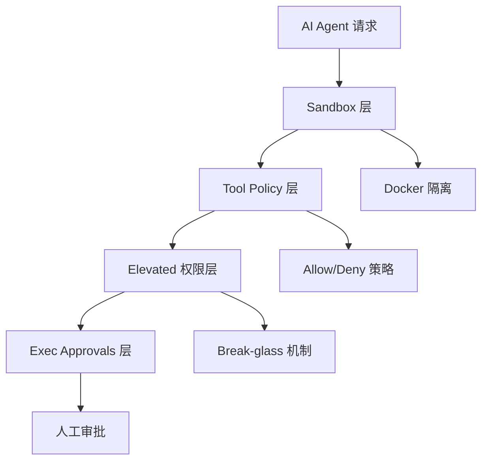
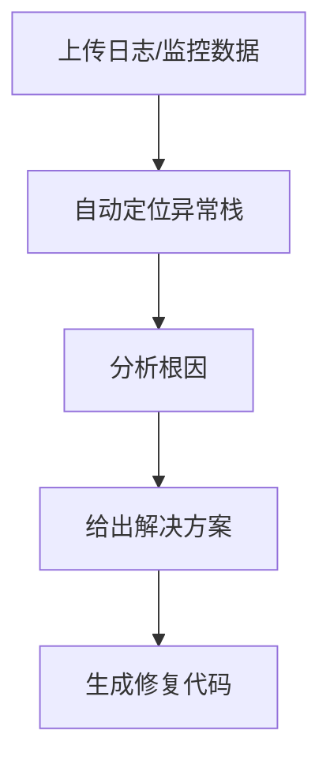

# AI Rule + AI Skill 体系化解决方案

> 基于OpenClaw生态的AI提效完整实施方案

## 🎯 方案概述

本方案整合OpenClaw安全体系、AI记忆分层设计、Claude Code工程实践等最佳实践，构建一套完整的AI Rule + AI Skill体系化解决方案，帮助技术团队实现AI辅助开发的规范化、安全化和高效化。

## 🏗️ 核心架构

### 1. 三层安全架构（基于OpenClaw安全体系）



#### 1.1 Sandbox 层（运行环境隔离）
- **Docker 容器化**：默认无网络、无宿主机文件系统访问
- **Workspace 访问控制**：none/ro/rw 三种模式
- **Bind Mount 限制**：显式声明挂载路径和权限

#### 1.2 Tool Policy 层（能力白名单）
- **Allow 列表**：精确控制可用工具
- **Deny 列表**：硬性拒绝高风险操作
- **分层策略**：全局策略 + Sandbox 专用策略

#### 1.3 Elevated 权限层（逃逸通道）
- **三种模式**：on/ask/full
- **审批机制**：elevated 操作需人工确认
- **审计日志**：完整记录所有逃逸操作

### 2. AI记忆分层设计（4W Taxonomy）

#### 2.1 When（生命周期维度）
| 记忆类型 | 生命周期 | 存储位置 | 适用场景 |
|---------|---------|----------|----------|
| Transient | 瞬时 | 上下文缓存 | 实时处理、输入缓冲 |
| Session | 会话级 | 内存+本地存储 | 单次任务、working memory |
| Persistent | 持久化 | 外部存储系统 | 跨会话、长期经验 |

#### 2.2 What（记忆内容维度）
```yaml
memory_types:
  procedural:     # 程序性记忆
    - 工具调用方式
    - 任务分解流程
    - 编码规范
    
  declarative:    # 陈述性记忆
    - 事实信息
    - 事件记录
    - 观察结果
    
  metacognitive:  # 元认知记忆
    - 反思总结
    - 自我评估
    - 策略优化
    
  personalized:   # 个性化记忆
    - 用户偏好
    - 历史交互
    - 画像信息
```

#### 2.3 How（存储形式维度）
- **Parametric**（模型参数）：推理零延迟，更新代价大
- **Latent**（隐状态）：紧凑高效，可解释性差
- **Raw Text**（原始文本）：可解释性强，检索效率低
- **Vector DB**（向量数据库）：语义检索，适合相似性搜索
- **Structured Graph**（知识图谱）：多跳推理，关系建模

#### 2.4 Which（模态维度）
- **单模态**：纯文本处理
- **多模态**：文本+图像+音频+视频
- **Socratic Representation**：多模态转文本统一处理

### 3. Claude Code 工程化实践

#### 3.1 配置体系 7 构件
```
project/
├── CLAUDE.md          # 项目级记忆与约定
└── .claude/
    ├── rules/         # 强制性规则
    ├── agents/        # 专用子代理
    ├── commands/      # 高频斜杠命令
    ├── skills/        # 可复用方法论
    ├── hooks/         # 自动化守卫
    └── settings.json  # 配置文件
```

#### 3.2 黄金法则
1. **Plan Mode 默认入口**：先规划再动手
2. **CLAUDE.md 项目章程**：写"失忆后给自己的笔记"
3. **上下文管理**：20-40% 开始退化，及时重置
4. **需求接口化**：验收标准比形容词重要
5. **卡住换变量**：三次解释不通就改变策略
6. **聊天系统化**：做成可重复执行的流水线

## 🛠️ AI Skill 体系（8大核心技能）

### 技能1：后端代码自动生成
```text
你是资深后端工程师，使用{语言}+{框架}，遵循团队AI Rule：
1. 按Controller→Service→Dao→Entity分层生成代码
2. 加入参数校验、全局异常处理、TraceID日志
3. 代码符合{编码规范}，无语法错误，可直接编译
需求：{业务需求+表结构}
```

### 技能2：数据库设计与SQL优化
- 三范式表结构设计
- 索引优化建议
- 慢SQL分析与调优
- 数据迁移脚本生成

### 技能3：接口文档&自动化测试
| 输出类型 | 自动生成内容 |
|---------|-------------|
| 接口文档 | Swagger注解、OpenAPI规范 |
| 单元测试 | JUnit/Mockito测试用例 |
| 集成测试 | Postman脚本、自动化测试 |
| 性能测试 | JMeter压测脚本 |

### 技能4：问题排查&故障定位


### 技能5：配置&部署自动化
- 多环境配置文件生成
- Dockerfile与docker-compose
- K8s Deployment/Service/ConfigMap
- CI/CD流水线脚本

### 技能6：通用工具类封装
- 日期工具类
- 加密解密工具
- Excel导入导出
- Redis缓存封装
- HTTP客户端封装

### 技能7：代码重构&规范对齐
- 分层架构重构
- 技术版本升级（SpringBoot 2.x→3.x）
- 重复代码提取
- 性能瓶颈优化

### 技能8：知识沉淀&新人培训
- 技术文档自动生成
- 新人上手教程
- 常见问题FAQ
- 最佳实践总结

## 🔒 AI Rule 体系

### 安全合规Rule
```yaml
security_rules:
  data_protection:
    - 禁止上传生产环境数据、密钥、配置
    - 代码片段脱敏：核心业务逻辑必须打码
    - 禁止使用公共AI生成核心业务逻辑
    
  code_review:
    - AI生成代码必须经过人工审核+安全扫描
    - 限定AI工具范围：企业版/私有化大模型
```

### 编码规范Rule
```yaml
coding_standards:
  architecture:
    - 强制分层架构：Controller/Service/Dao/Util
    - 统一异常处理、错误码体系
    - 必须包含TraceID链路追踪
  
  database:
    - 禁止生成无索引、慢SQL
    - 必须使用事务管理
    - 统一连接池配置
```

### 质量校验Rule
```yaml
quality_gates:
  syntax_check: 必须可编译、无语法错误
  unit_test: 100%通过率
  code_scan: 通过SAST安全扫描
  complexity: 圈复杂度≤10
  duplication: 重复率≤20%
```

## 📊 实施计划

### 阶段1：基础建设（第1周）
| 任务 | 负责人 | 交付物 |
|------|--------|--------|
| AI Rule规范制定 | 技术负责人 | 安全+编码+质量规则 |
| 私有化AI平台部署 | 架构师 | 企业级AI环境 |
| 开发工具集成 | DevOps | IDE插件+CI/CD流程 |

### 阶段2：AI Skill开发（第2-3周）
| 周次 | 任务内容 | 输出 |
|------|---------|------|
| 第2周 | 8大技能Prompt模板开发 | 标准化模板库 |
| 第2周 | 团队技术栈定制 | SpringCloud/微服务模板 |
| 第3周 | IDE插件开发 | IDEA/VS Code插件 |
| 第3周 | 工具链集成 | 完整开发工具包 |

### 阶段3：全流程落地（第4周）
- 全员使用AI Rule+Skill日常开发
- 效率数据收集与优化
- AI技能库月度更新机制

## 🛠️ 工具链支撑

### 开发工具矩阵
| 工具类型 | 推荐方案 | 用途 |
|---------|---------|------|
| 编码工具 | IDEA + 通义智码 | 智能代码补全 |
| 代码校验 | SonarQube | 质量门禁 |
| 安全扫描 | SAST工具 | 安全审计 |
| AI平台 | 私有化大模型 | 数据安全保障 |
| 流程工具 | GitLab + Jenkins | CI/CD流水线 |

### MCP集成
```json
{
  "mcp_servers": {
    "github": {
      "command": "npx",
      "args": ["@modelcontextprotocol/server-github"]
    },
    "database": {
      "command": "npx", 
      "args": ["@modelcontextprotocol/server-postgres"]
    }
  }
}
```

## 📈 效果衡量

### 核心KPI指标
| 指标类别 | 目标值 | 监控方式 |
|---------|--------|----------|
| 编码效率提升 | 40%+ | 需求管理系统 |
| 代码缺陷率 | 降低30% | 缺陷跟踪系统 |
| 自动化覆盖率 | 80% | CI/CD统计 |
| 新人上手效率 | 提升50% | 培训记录 |

### 质性评估
- ✅ **代码质量**：规范统一度、可读性、可维护性
- ✅ **团队协作**：知识传承效率、沟通成本降低  
- ✅ **开发体验**：AI辅助满意度、工作负担减轻
- ✅ **技术沉淀**：最佳实践积累、知识库完善

## ⚠️ 风险与规避

### 安全风险
| 风险点 | 规避措施 |
|--------|----------|
| 敏感数据泄露 | 私有化部署，数据脱敏 |
| 代码安全漏洞 | 强制安全扫描，人工审核 |
| 版权合规问题 | 禁止使用公共AI生成核心业务逻辑 |

### 质量风险
| 风险点 | 规避措施 |
|--------|----------|
| AI代码质量不稳定 | 建立质量门禁，多轮校验 |
| 过度依赖AI | 保持人工核心能力，AI辅助定位 |
| 技术债务积累 | 定期代码重构，技术升级 |

## 🎯 成功关键因素

### 组织保障
- **高层支持**：管理层认可和资源投入
- **专人负责**：AI提效专员推进实施
- **激励机制**：将AI使用纳入KPI考核

### 技术保障  
- **基础设施**：私有化AI平台部署
- **工具集成**：与现有开发工具链打通
- **数据安全**：完善的数据保护机制

### 持续优化
- **反馈机制**：定期收集使用反馈
- **迭代更新**：基于数据持续优化
- **最佳实践**：总结推广成功经验

## 📋 实施检查清单

### ✅ 启动前准备
- [ ] 团队AI Rule规范制定完成
- [ ] 私有化AI平台部署到位
- [ ] 开发工具插件安装配置
- [ ] 代码质量门禁流程建立

### ✅ 阶段一验收
- [ ] AI Rule全员培训完成
- [ ] 代码校验流程跑通
- [ ] 基础AI工具链就绪
- [ ] 安全扫描机制启用

### ✅ 阶段二验收
- [ ] 8大AI Skill模板开发完成
- [ ] IDE插件功能测试通过
- [ ] 团队技术栈定制完成
- [ ] 工具链集成测试通过

### ✅ 阶段三验收
- [ ] 全员日常使用AI辅助开发
- [ ] 效率数据收集机制建立
- [ ] 质量指标达成预期目标
- [ ] 持续优化机制建立运行

---

> **方案总结**：本方案通过整合OpenClaw安全体系、AI记忆分层设计、Claude Code工程实践等最佳实践，构建了一套完整的AI Rule + AI Skill体系化解决方案。方案从安全合规、编码规范、质量保障三个维度建立AI规则体系，从代码生成、数据库设计、接口文档等八个方面构建AI技能库，为技术团队提供了一套可复制、可落地、可迭代的AI辅助开发完整解决方案，助力企业实现数字化转型和研发效能提升。