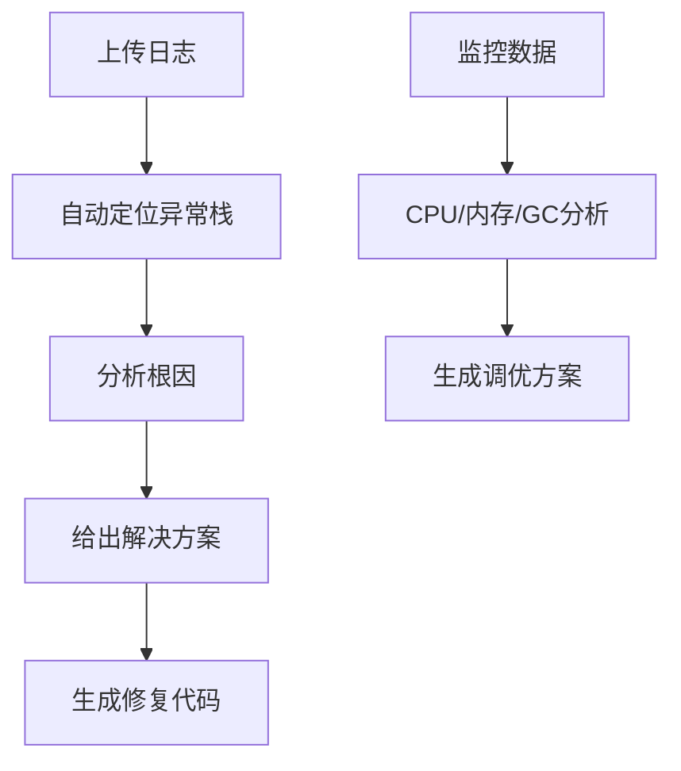
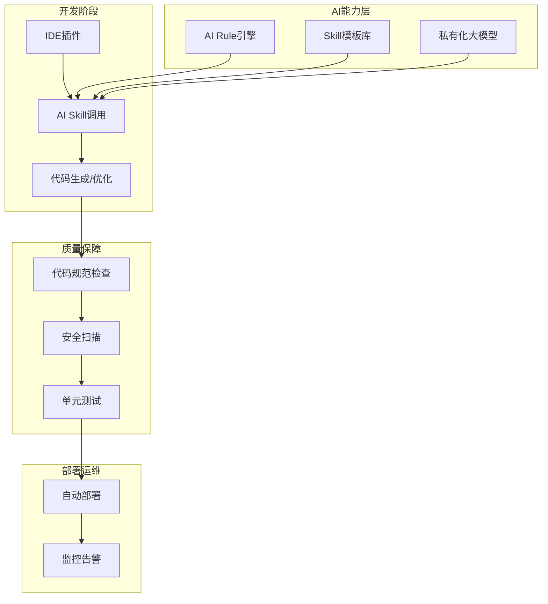

# AI提效体系化建设优化方案

> 面向后端团队的AI Rule + AI Skill全栈提效方案

## 🎯 方案定位

**AI Rule**：团队统一的AI使用规范、约束、标准、校验规则（解决AI输出不规范、不可用、不安全问题）  
**AI Skill**：面向后端场景的AI专项能力模板、工具链、自动化流程（解决AI只会泛写代码、不会解决后端实际问题）

## 📈 核心目标

| 指标类型 | 目标值 | 说明 |
|---------|--------|------|
| 编码效率提升 | 40%+ | 重复代码编写减少60% |
| 接口/数据库bug | 降低30% | 配置类问题减少 |
| 自动化覆盖率 | 80% | 测试、文档、部署流程 |
| 新人上手效率 | 提升50% | 技术标准统一 |

## 🛡️ 一、AI Rule体系（规则引擎）

### 1.1 安全合规Rule（底线规则）

```yaml
security_rules:
  data_protection:
    - 禁止上传生产环境数据、密钥、配置、用户隐私
    - 代码片段脱敏：核心业务逻辑必须打码
    - 禁止使用公共AI生成核心业务逻辑、支付、鉴权代码
  
  code_review:
    - AI生成代码必须经过人工审核+安全扫描
    - 限定AI工具范围：仅允许企业版/私有化大模型
    
  deployment:
    - 禁止AI直接生成生产环境部署脚本
    - 禁止生成未开源、有版权风险的代码片段
```

### 1.2 后端编码规范Rule（强制标准）

```yaml
coding_standards:
  language: [Java, Python, Go, C++]
  architecture:
    - 强制分层架构：Controller/Service/Dao/Util
    - 统一异常处理、错误码体系
    - 必须包含TraceID链路追踪
  
  database:
    - 禁止生成无索引、慢SQL
    - 必须使用事务管理
    - 统一连接池配置
  
  api_design:
    - 严格遵循RESTful/GraphQL规范
    - 统一返回格式、状态码
    - 强制入参校验（JSR380）
```

### 1.3 质量校验Rule（准入规则）

```yaml
quality_gates:
  syntax_check: 必须可编译、无基础语法错误
  unit_test: 100%通过率
  code_scan: 通过SAST安全扫描
  code_review: 人工审核通过
  
  metrics:
    complexity: 圈复杂度≤10
    duplication: 重复率≤20%
    coverage: 测试覆盖率≥70%
```

## 🚀 二、AI Skill体系（8大核心技能）

### 2.1 技能1：后端代码自动生成Skill

**适用场景**：Controller/Service/Dao/Entity/VO/DTO  
**核心能力**：

| 功能模块 | 自动生成内容 |
|---------|-------------|
| Controller | RESTful接口、参数校验、异常处理 |
| Service | 业务逻辑、事务管理、缓存策略 |
| Dao | MyBatis/JPA代码、SQL语句、分页查询 |
| Entity | 实体类、字段映射、注解配置 |
| 配置类 | Redis、消息队列、多数据源配置 |

**标准Prompt模板**：
```text
你是资深后端工程师，使用{语言}+{框架}，遵循团队AI Rule：
1. 按Controller→Service→Dao→Entity分层生成代码
2. 加入参数校验、全局异常处理、TraceID日志
3. 代码符合{编码规范}，无语法错误，可直接编译
需求：{业务需求+表结构}
```

### 2.2 技能2：数据库设计与SQL优化Skill

**适用场景**：建表语句、索引设计、SQL优化、慢SQL分析  
**核心能力**：

- ✅ 根据业务需求生成三范式表结构+建表SQL
- ✅ 自动设计联合索引、唯一索引、分区表
- ✅ 分析慢SQL，给出执行计划+优化方案
- ✅ 生成数据迁移脚本、回滚脚本

### 2.3 技能3：接口文档&自动化测试Skill

**适用场景**：Swagger/OpenAPI文档、Postman脚本、单元测试  
**核心能力**：

| 输出类型 | 自动生成内容 |
|---------|-------------|
| 接口文档 | Swagger注解、OpenAPI规范、字段说明 |
| 单元测试 | JUnit/Mockito测试用例、覆盖率≥80% |
| 集成测试 | Postman脚本、自动化测试用例 |
| 性能测试 | JMeter脚本、压测配置、性能指标 |

### 2.4 技能4：问题排查&故障定位Skill

**适用场景**：日志分析、线上bug、服务宕机、性能问题  
**核心能力**：



### 2.5 技能5：配置&部署自动化Skill

**适用场景**：多环境配置、Docker容器化、K8s部署、CI/CD  
**输出清单**：

```yaml
# 多环境配置
configs:
  - application-dev.yml
  - application-test.yml  
  - application-prod.yml

# 容器化部署
docker:
  - Dockerfile
  - docker-compose.yml
  - .dockerignore

# K8s部署文件
kubernetes:
  - deployment.yaml
  - service.yaml
  - configmap.yaml
  - ingress.yaml

# CI/CD流水线
cicd:
  - Jenkinsfile
  - GitHub Actions
  - GitLab CI
```

### 2.6 技能6：通用工具类封装Skill

**适用场景**：工具类、常量类、枚举类、通用组件  
**标准库清单**：

| 工具类型 | 包含组件 |
|---------|---------|
| 日期工具 | DateUtils、LocalDateTimeUtils |
| 加密工具 | AESUtils、RSAUtils、MD5Utils |
| Excel工具 | EasyExcelUtils、POIUtils |
| HTTP工具 | RestTemplateUtils、OkHttpUtils |
| Redis工具 | RedisUtils、分布式锁 |
| 业务组件 | 分页工具、返回体封装、异常处理 |

### 2.7 技能7：代码重构&规范对齐Skill

**适用场景**：老代码重构、规范统一、技术升级  
**重构能力**：

- 🔄 混乱代码→分层架构重构
- 🔄 SpringBoot 2.x→3.x自动升级
- 🔄 重复代码提取→公共方法
- 🔄 性能优化→缓存策略、SQL优化

### 2.8 技能8：知识沉淀&新人培训Skill

**适用场景**：技术文档、新人手册、FAQ  
**输出类型**：

```text
📋 技术文档：需求分析、架构设计、接口说明
📚 新人手册：环境搭建、开发规范、常见问题
🔍 业务文档：业务流程、核心逻辑、数据模型
📊 运维文档：部署手册、监控配置、应急预案
```

## ⚙️ 三、落地实施计划

### 📅 阶段1：规则搭建与工具选型（第1周）

| 任务项 | 负责人 | 交付物 |
|-------|--------|--------|
| AI Rule团队规范文档 | 技术负责人 | 规范文档+全员培训 |
| 企业级AI工具选型 | 架构师 | 私有化模型部署方案 |
| AI代码校验流程 | DevOps | Git+CI+代码扫描流程 |

### 📅 阶段2：AI Skill库开发（第2-3周）

| 周次 | 任务内容 | 输出 |
|------|---------|------|
| 第2周 | 8大技能Prompt模板开发 | 标准化模板库 |
| 第2周 | 团队技术栈Skill定制 | SpringCloud/微服务模板 |
| 第3周 | IDE插件开发 | IDEA/VS Code插件 |
| 第3周 | 工具链集成 | 完整开发工具包 |

### 📅 阶段3：全流程落地与优化（第4周）

| 任务类型 | 具体内容 |
|---------|---------|
| 推广应用 | 全员使用AI Rule+Skill日常开发 |
| 数据收集 | 效率指标、质量指标统计 |
| 迭代优化 | 基于数据反馈优化规则模板 |
| 机制建立 | AI技能库月度更新机制 |

## 🛠️ 四、工具链支撑

### 4.1 开发工具矩阵

| 工具类型 | 推荐方案 | 用途 |
|---------|---------|------|
| 编码工具 | IDEA + 通义智码/CodeGeeX | 智能代码补全 |
| 代码校验 | SonarQube + Alibaba规范 | 质量门禁 |
| 安全扫描 | SAST工具 + 密钥检测 | 安全审计 |
| AI平台 | 企业私有化大模型 | 数据安全保障 |
| 流程工具 | GitLab + Jenkins | CI/CD流水线 |

### 4.2 架构图



## 📊 五、效果衡量体系

### 5.1 核心KPI指标

| 指标类别 | 具体指标 | 目标值 | 采集方式 |
|---------|---------|--------|----------|
| 效率指标 | 单需求开发时长 | 减少40% | 需求管理系统 |
| 效率指标 | 重复代码编写时长 | 减少60% | 代码统计工具 |
| 质量指标 | AI代码bug率 | <5% | 缺陷跟踪系统 |
| 质量指标 | 线上故障数 | 减少30% | 监控系统 |
| 成本指标 | 新人培训成本 | 减少50% | 培训记录 |
| 复用指标 | AI Skill调用次数 | 持续增长 | 平台统计 |

### 5.2 质性评估维度

- ✅ **代码质量**：规范统一度、可读性、可维护性
- ✅ **团队协作**：知识传承效率、沟通成本降低
- ✅ **开发体验**：AI辅助满意度、工作负担减轻
- ✅ **技术沉淀**：最佳实践积累、知识库完善

## ⚠️ 六、风险与规避方案

### 6.1 安全风险

| 风险点 | 影响 | 规避措施 |
|--------|------|----------|
| 敏感数据泄露 | 高 | 严格执行AI Rule，私有化模型部署 |
| 代码安全漏洞 | 中 | 强制安全扫描，AI代码人工审核 |
| 版权合规问题 | 中 | 禁止使用公共AI生成核心业务逻辑 |

### 6.2 质量风险

| 风险点 | 影响 | 规避措施 |
|--------|------|----------|
| AI代码质量不稳定 | 中 | 建立质量门禁，多轮校验机制 |
| 过度依赖AI | 低 | 保持人工核心能力，AI辅助定位 |
| 技术债务积累 | 中 | 定期代码重构，技术升级 |

### 6.3 管理风险

| 风险点 | 影响 | 规避措施 |
|--------|------|----------|
| 团队接受度低 | 中 | 分阶段培训，激励机制 |
| 规范执行不到位 | 高 | 自动化检查，纳入考核体系 |
| 技能库维护成本 | 低 | 建立更新机制，专人负责 |

## 🎯 七、成功关键因素

### 7.1 组织保障

- **高层支持**：管理层认可和资源投入
- **专人负责**：AI提效专员推进实施
- **激励机制**：将AI使用纳入KPI考核

### 7.2 技术保障

- **基础设施**：私有化AI平台部署
- **工具集成**：与现有开发工具链打通
- **数据安全**：完善的数据保护机制

### 7.3 持续优化

- **反馈机制**：定期收集使用反馈
- **迭代更新**：基于数据持续优化
- **最佳实践**：总结推广成功经验

## 📋 八、实施检查清单

### ✅ 启动前准备

- [ ] 团队AI Rule规范制定完成
- [ ] 私有化AI平台部署到位
- [ ] 开发工具插件安装配置
- [ ] 代码质量门禁流程建立

### ✅ 阶段一验收

- [ ] AI Rule全员培训完成
- [ ] 代码校验流程跑通
- [ ] 基础AI工具链就绪
- [ ] 安全扫描机制启用

### ✅ 阶段二验收

- [ ] 8大AI Skill模板开发完成
- [ ] IDE插件功能测试通过
- [ ] 团队技术栈定制完成
- [ ] 工具链集成测试通过

### ✅ 阶段三验收

- [ ] 全员日常使用AI辅助开发
- [ ] 效率数据收集机制建立
- [ ] 质量指标达成预期目标
- [ ] 持续优化机制建立运行

---

> **方案总结**：通过AI Rule+AI Skill双轮驱动，构建标准化、自动化、智能化的后端开发体系，实现团队开发效率和质量的双提升，为企业数字化转型提供强有力的技术支撑。