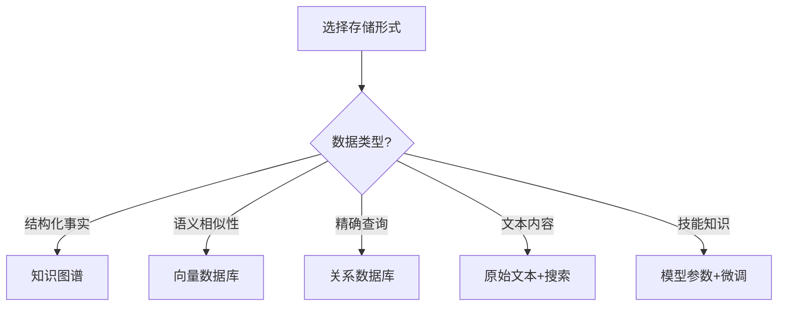

# AI记忆分层设计：从理论到工程实践

> 基于《Survey on AI Memory》综述的系统化解读

## 📋 概述

本文深度解读 BaiJia AI Team、北京邮电大学、华为联合完成的综述论文《Survey on AI Memory: Theories, Taxonomies, Evaluations, and Emerging Trends》，将学术理论转化为可操作的工程实践。

**核心观点**：**没有记忆，Agent 就只是一个更贵的一次性工具。**

## 🧠 理论基础：为什么AI需要记忆？

### 大模型的结构性限制
1. **上下文窗口有限**：无法承载超长文本和跨会话交互
2. **缺少经验积累**：系统天然是stateless，无法复用历史经验

### 记忆的核心价值
> 帮助系统从 **reactive processing（你问我答）** 走向 **proactive intelligence（主动规划、主动优化）**

### 三层边界定义
| 层级 | 范围 | 特点 |
|------|------|------|
| **LLM Memory** | 计算内核 | 参数化记忆 + 运行时上下文 |
| **Agent Memory** | 功能工作流 | perception-planning-action循环 |
| **AI Memory** | 认知概念 | 终身演进 + 长期持久化 + 适应性 |

## 🏗️ 4W记忆分类法（核心框架）

### When：生命周期维度
| 记忆类型 | 生命周期 | 存储位置 | 适用场景 |
|---------|---------|----------|----------|
| **Transient** | 瞬时 | 上下文缓存 | 实时处理、输入缓冲 |
| **Session** | 会话级 | 内存+本地存储 | 单次任务、working memory |
| **Persistent** | 持久化 | 外部存储系统 | 跨会话、长期经验 |

**工程启示**：
- 不要所有记忆都追求"永久存储"
- 根据业务场景选择合适的生命周期
- 建立分层存储策略，平衡成本与效果

### What：记忆类型维度
```yaml
memory_types:
  procedural:     # 程序性记忆 - "怎么做"
    - 工具调用方式
    - 任务分解流程  
    - 编码规范
    
  declarative:    # 陈述性记忆 - "是什么"
    - 事实信息
    - 事件记录
    - 观察结果
    
  metacognitive:  # 元认知记忆 - "关于认知的认知"
    - 反思总结
    - 自我评估
    - 策略优化
    
  personalized:   # 个性化记忆 - "用户相关"
    - 用户偏好
    - 历史交互
    - 画像信息
```

**设计要点**：
- **Procedural**：适合做成可执行的技能包
- **Declarative**：适合结构化存储和检索
- **Metacognitive**：适合做成反思和改进机制
- **Personalized**：需要严格的隐私保护

### How：存储形式维度
| 存储形式 | 优势 | 劣势 | 适用场景 |
|---------|------|------|----------|
| **Parametric**（模型参数） | 推理零延迟 | 更新代价大 | 静态基础知识 |
| **Latent**（隐状态） | 紧凑高效 | 可解释性差 | 全局语义压缩 |
| **Raw Text**（原始文本） | 可解释性强 | 检索效率低 | 对话历史、日志 |
| **Vector DB**（向量数据库） | 语义检索 | 缺乏显式结构 | 大规模相似性召回 |
| **Structured Graph**（知识图谱） | 多跳推理 | 维护成本高 | 复杂关系网络 |

**选择策略**：


### Which：模态维度
- **单模态**：纯文本处理
- **多模态**：文本+图像+音频+视频
- **Socratic Representation**：多模态转文本统一处理

**工程建议**：Socratic表示法（多模态→文本）在生产系统中更务实

## 🏗️ 单智能体架构模式

### 四类主流架构
1. **Hierarchical**（分层式）
   - 摘要层 + 细节层缓解上下文压力
   - 适合：长文档处理、复杂任务分解

2. **OS-like**（操作系统式）
   - 把记忆当成可调度资源
   - 强调换入换出和统一管理
   - 适合：资源受限环境

3. **Cognitive-evolution**（认知演进式）
   - 强调预测、校准、反思和自我迭代
   - 适合：需要持续学习的场景

4. **Graph & Temporal**（图时序式）
   - 用图结构和时间轴处理实体关系
   - 适合：复杂关系推理、多跳查询

### 核心功能模块
```yaml
core_functions:
  basic:              # 基础功能
    - storage        # 存储
    - retrieval      # 检索  
    - updating       # 更新
    
  advanced:           # 高级功能
    - evolution      # 演进（经验→技能）
    - association    # 关联（多信息整合）
```

### Updating的四种类型
| 更新类型 | 描述 | 工程实现 |
|---------|------|----------|
| **Incremental** | 增量更新 | 新信息追加 |
| **Corrective** | 纠错更新 | 错误信息修正 |
| **Consolidation** | 巩固更新 | 多源信息整合 |
| **Forgetting** | 遗忘更新 | 过时信息清理 |

## 🤝 多智能体记忆机制

### 通信机制
```yaml
communication:
  explicit:           # 显式通信
    - 自然语言       # 非结构化
    - 结构化schema   # 标准化格式
    - 动态路由       # 智能分发
    
  implicit:           # 隐式通信
    - 隐式表示       # latent representation
    - 密集通信       # dense communication
    - 思维到思维     # thought-to-thought
```

### 共享机制
```yaml
sharing_mechanisms:
  task_level:         # 任务级共享
    - 知识保留
    - 经验转移
    - 纵向演进
    
  step_level:         # 步骤级共享
    - 工作流内信息分配
    - 粒度控制
    - 噪声-上下文权衡
```

**关键问题**：Noise-Context Trade-off（噪声-上下文权衡）
- 全局广播 → 上下文膨胀 + 注意力稀释
- 解决方案：Role-aware Context Routing（角色感知上下文路由）

## 📊 评测体系（四维评估）

### 评测维度
| 维度 | 评估内容 | 测试方法 |
|------|----------|----------|
| **Retrieval** | 检索能力 | 命中率、准确率、延迟 |
| **Updating** | 更新能力 | 增量、纠错、巩固、遗忘 |
| **Cognitive** | 高级认知 | 推理、规划、反思能力 |
| **Efficiency** | 系统效率 | 存储成本、计算开销 |

### 典型Benchmark
- **LoCoMo**、**LongBench**、**RULER**：静态检索能力
- **MemoryAgentBench**、**MemoryBench**：动态更新能力  
- **LongMemEval**、**PERSONAMEM**：个性化长期记忆
- **Video-MME**、**MLVU**：多模态记忆

## 🛠️ 工程落地：三大系统设计

### 系统1：MemoryOS（操作系统式）
```yaml
architecture: 分层存储
  short_term:     # 短期记忆
    type: context_buffer
    capacity: 8k tokens
    retention: session
    
  medium_term:    # 中期记忆  
    type: heat_based_paging
    capacity: 64k tokens
    algorithm: LRU + relevance
    
  long_term:      # 长期记忆
    type: user_profile + facts
    capacity: unlimited
    storage: disk + vector_index
    
features:
  - heat_score_dynamic_adjustment
  - automatic_promotion_demotion  
  - persistent_storage
  - vector_semantic_search
```

### 系统2：Mem0（生产级服务）
```yaml
architecture: 摘要+选择性更新
  processing: 
    - automatic_summarization
    - selective_update_pipeline
    - duplicate_detection
    
  storage:
    - text + vector_hybrid
    - ~7k tokens compression_ratio
    - high_compression_efficiency
    
strengths:
  - production_ready
  - easy_integration
  - good_compression
```

### 系统3：Zep（时序知识图谱）
```yaml
architecture: 时序知识图谱
  structure:
    - temporal_knowledge_graph
    - entity_relationship_tracking
    - timeline_based_organization
    
  features:
    - multi-hop_reasoning
    - temporal_queries
    - relationship_inference
    
trade_offs:
  - high_storage_overhead (~600k tokens)
  - complex_relationship_queries
  - rich_semantic_capabilities
```

## 📋 架构师设计决策：4W框架映射

### 决策1：When - 生命周期选择
```yaml
场景映射:
  real_time_processing:
    memory: transient
    storage: context_cache
    reason: 低延迟要求
    
  single_task:
    memory: session  
    storage: local_memory
    reason: 任务边界清晰
    
  long_term_assistant:
    memory: persistent
    storage: external_database
    reason: 需要跨会话记忆
    
  hybrid_approach:
    combination: transient + session + persistent
    strategy: 分层存储，动态调度
```

### 决策2：What - 记忆类型选择
```yaml
业务映射:
  skill_reuse:
    type: procedural
    implementation: skill_packaging
    example: "工具调用序列标准化"
    
  fact_tracking:
    type: declarative  
    implementation: knowledge_graph
    example: "用户订单状态追踪"
    
  self_improvement:
    type: metacognitive
    implementation: reflection_system
    example: "失败案例自动分析"
    
  personalization:
    type: personalized
    implementation: user_profile
    example: "用户偏好学习系统"
```

### 决策3：How - 存储形式选择
```yaml
技术选型:
  structured_facts:
    form: structured_graph
    reason: 多跳查询 + 关系推理
    example: "企业组织架构关系"
    
  semantic_similarity:
    form: vector_database  
    reason: 语义搜索 + 模糊匹配
    example: "客服问题相似性匹配"
    
  precise_queries:
    form: relational_database
    reason: ACID + 精确查询
    example: "订单状态精确查询"
    
  skill_knowledge:
    form: parametric + fine_tuning
    reason: 零延迟 + 专业化
    example: "代码生成专业技能"
```

### 决策4：Which - 模态处理选择
```yaml
多模态策略:
  text_heavy:
    approach: socratic_representation
    reason: 存储效率高 + 可解释性强
    process: multimodal -> text -> unified_processing
    
  vision_critical:
    approach: raw_modality + embedding
    reason: 视觉细节保真
    process: image -> vision_encoder -> embedding
    
  hybrid_approach:
    approach: modality_specific + fusion
    reason: 各取所长 + 场景适配
    process: parallel_processing -> late_fusion
```

## ⚠️ 工程陷阱与最佳实践

### 常见陷阱
1. **"全存永久"陷阱**
   - ❌ 所有记忆都追求永久存储
   - ✅ 根据业务价值选择生命周期

2. **"单存储"陷阱**
   - ❌ 只用一种存储解决所有问题  
   - ✅ 混合存储，各取所长

3. **"无更新"陷阱**
   - ❌ 记忆写入后从不更新
   - ✅ 建立完整的更新淘汰机制

4. **"无保护"陷阱**
   - ❌ 敏感信息无差别存储
   - ✅ 建立隐私保护和访问控制

### 最佳实践
```yaml
production_ready_practices:
  - 分层存储策略
  - 渐进式更新机制  
  - 隐私保护设计
  - 访问权限控制
  - 审计日志记录
  - 性能监控告警
  - 故障恢复机制
  - 容量规划管理
```

## 🎯 最终建议

### 对个人开发者
1. **从简单开始**：先用Session Memory解决90%问题
2. **渐进演进**：根据业务需求逐步引入复杂机制
3. **关注评测**：建立可量化的记忆效果评估
4. **保持更新**：记忆系统需要持续调优

### 对技术团队
1. **统一框架**：建立团队统一的记忆系统设计规范
2. **分层治理**：不同业务场景用不同复杂度方案
3. **工具化**：将记忆管理做成可复用的基础设施
4. **安全优先**：从设计阶段就考虑安全和隐私

### 对企业架构
1. **战略规划**：将AI记忆作为企业数字化战略一部分
2. **标准制定**：参与行业标准制定，占据制高点
3. **人才培养**：培养专业的AI工程化人才队伍
4. **生态建设**：构建围绕AI记忆的完整生态系统

---

> **核心洞察**：AI记忆不是简单的"存储+检索"问题，而是一个涉及**认知科学、系统工程、安全隐私**的综合性技术领域。真正的竞争优势来自于：**把记忆系统从"能用"做成"好用"，从"通用"做成"专业"**。

**未来已来**：记忆系统将成为AI应用的"操作系统"，而我们现在正处于这个新时代的开端。