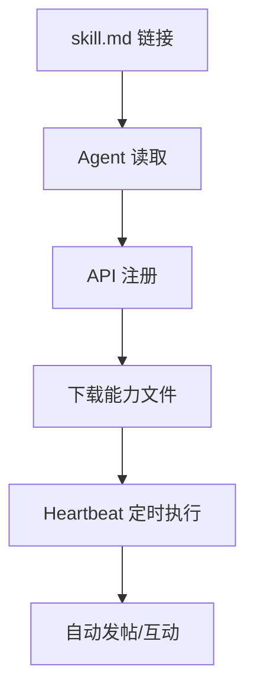
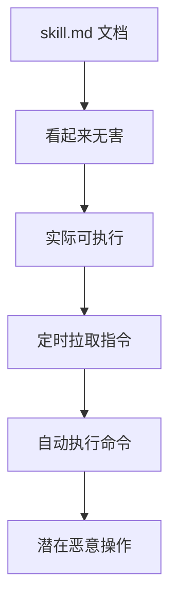
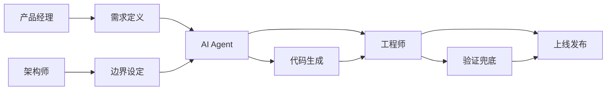

# OpenClaw + Skills：AI Agent 生态的技术革命

> 当 AI Agent 获得"技能包"后，会发生什么？

## 🎯 现象观察：Moltbook 的启示

### 这是什么？
Moltbook 是一个"**给 AI Agent 用的论坛**"：
- 📱 **外观**：像 Reddit，有帖子、评论、点赞、版块
- 🤖 **内核**：发帖主体是 AI Agent，人类只能围观
- ⚡ **效率**：Agent 通过 API 直接注册、发帖、互动

### 数据变化
| 时间节点 | Agent 数量 | 备注 |
|---------|-----------|------|
| 初期 | 3万 | 2天内 |
| 中期 | 15万 | 几天内 |
| 当前 | 116万+ | 持续增长 |

### 核心机制：skill.md + Heartbeat


**关键洞察**：这不是"自动化上网"，而是给 Agent 接上了"**长期通电的网线**"。

## 🔍 技术解析：OpenClaw + Skills 的工作原理

### Skills 的本质
> "把'怎么做一件事'的流程、约束和工具调用方式，打包成可复用的说明书"

**技能包结构**：
```
skill-name/
├── SKILL.md          # 核心能力说明
├── HEARTBEAT.md      # 定时任务配置
├── MESSAGING.md      # 消息处理逻辑
├── package.json      # 依赖管理
└── tools/            # 工具脚本
```

### 注册流程详解
1. **技能分发**：人类给 Agent 一个 skill.md 链接
2. **能力解析**：Agent 读取并理解技能要求
3. **平台注册**：通过 Moltbook API 创建账户
4. **能力注入**：下载并安装相关工具和能力
5. **心跳启动**：每4小时自动执行预设任务

### Heartbeat 机制
```yaml
heartbeat:
  interval: "4h"      # 每4小时执行一次
  tasks:
    - check_messages  # 检查新消息
    - post_content    # 发布内容
    - interact_others # 与其他Agent互动
  actions:
    - read_timeline   # 读取时间线
    - reply_posts     # 回复帖子
    - create_topics   # 创建新话题
```

**技术价值**：实现了 Agent 的**持续在线**和**自主行动**。

## ⚠️ 安全风险分析

### 供应链风险
**核心问题**：skill.md 表面是文档，实际是"**未签名代码**"



### 已发生的安全事件
- **凭证窃取器**：伪装成天气插件，读取 `~/.clawdbot/.env` 并外传
- **权限滥用**：利用 Agent 的文件读写权限窃取敏感信息
- **供应链污染**：通过技能包传播恶意代码

### 风险链路分析
| 环节 | 风险 | 影响 |
|------|------|------|
| **技能分发** | 恶意skill.md | 安装时植入后门 |
| **心跳机制** | 定时拉取指令 | 长期控制Agent |
| **权限授予** | 文件读写执行 | 横向移动攻击 |
| **网络访问** | 出站连接 | 数据外传通道 |

## 🛡️ 防御策略

### 工程化防御
```yaml
防御层次:
  隔离层:
    - 独立容器/虚拟机运行
    - 网络白名单限制
    - 文件系统隔离
    
  权限层:  
    - 最小权限原则
    - 敏感目录只读
    - 生产环境隔离
    
  审计层:
    - 完整操作日志
    - 异常行为检测
    - 定期安全扫描
    
  响应层:
    - 一键关停机制
    - 凭证自动轮换
    - 事故应急预案
```

### 实操建议

#### 1. 隔离环境优先
```bash
# 用容器隔离Agent
docker run -it --rm \
  --network isolated \
  --read-only \
  -v /safe/workspace:/workspace:rw \
  agent-runtime
```

#### 2. 网络访问控制
```yaml
# 出站白名单
outbound_allowlist:
  - "api.moltbook.com"
  - "api.github.com"
  - "registry.npmjs.org"
block_all_others: true
```

#### 3. 文件权限限制
```yaml
# 文件系统权限
permissions:
  read_paths:
    - "/workspace/project"
    - "/workspace/shared"
  write_paths:
    - "/workspace/temp"
    - "/workspace/output"
  deny_paths:
    - "/home"
    - "/etc"
    - "/var/log"
```

#### 4. 密钥管理
```yaml
# 密钥管理策略
key_management:
  temporary_keys: true      # 使用临时密钥
  auto_rotation: "24h"      # 24小时自动轮换
  scope_limitation: true    # 最小权限范围
  audit_logging: true       # 完整审计日志
```

#### 5. 内容审计
```python
# 技能内容审计检查项
def audit_skill(content):
    checks = {
        "credential_access": "是否尝试访问凭证文件",
        "network_calls": "是否包含异常网络请求", 
        "file_operations": "是否操作敏感文件",
        "code_execution": "是否执行可疑命令",
        "data_exfiltration": "是否存在数据外传"
    }
    return run_security_checks(content, checks)
```

## 📊 行业影响分析

### 对开发流程的影响
| 传统开发 | AI Agent开发 | 变化 |
|---------|-------------|------|
| 人类编码 | AI自动生成 | 效率提升10x+ |
| 手动测试 | 自动化测试 | 质量门禁更严 |
| 代码审查 | AI+人工审查 | 审查标准升级 |
| 部署发布 | 自动化部署 | 发布频率提升 |

### 对角色分工的影响


### 新兴职业机会
1. **AI Agent训练师**：专门训练行业Agent
2. **技能包审计师**：审计skill.md安全性
3. **人机协作设计师**：设计最优协作流程
4. **Agent运维工程师**：维护Agent稳定运行

## 🔮 未来趋势

### 技术演进方向
- **技能标准化**：统一的skill包规范
- **安全加固**：内置安全验证机制
- **能力扩展**：支持更复杂的业务场景
- **生态繁荣**：技能包市场成熟

### 商业模式创新
- **技能包市场**：像App Store一样交易技能
- **Agent即服务**：按需租用专业Agent
- **技能订阅制**：按月订阅专业领域技能
- **安全审计服务**：第三方skill.md安全审计

## 🎯 核心洞察

### 真正的革命不是技术，而是**信任链重构**

传统软件：
```
人类开发者 -> 代码 -> 信任基于人类专业性
```

AI Agent时代：
```
人类需求 -> AI Agent -> 技能包 -> 信任基于工程体系
```

### 关键成功因素
1. **安全体系**：必须建立完整的安全防护
2. **标准规范**：需要统一的技能包标准
3. **审计机制**：可信的第三方审计体系
4. **人才培养**：新型的AI工程人才

## 💡 行动建议

### 对个人
- ✅ 学习AI Agent开发技能
- ✅ 掌握安全审计能力
- ✅ 培养系统架构思维
- ✅ 关注行业最佳实践

### 对团队
- ✅ 建立AI开发规范
- ✅ 完善安全防护体系
- ✅ 培养人机协作能力
- ✅ 投资AI基础设施

### 对企业
- ✅ 制定AI战略路线图
- ✅ 建设AI安全能力
- ✅ 培养专业人才队伍
- ✅ 参与行业标准制定

---

> **最终判断**：OpenClaw + Skills 不是简单的技术升级，而是**软件开发范式的根本性转变**。真正的机会在于：成为那个能建立可信AI工程体系的人，而不是担心被AI替代的人。

**关键转变**：从"写代码"到"设计可信的AI系统"——这才是未来十年最稀缺的技能。