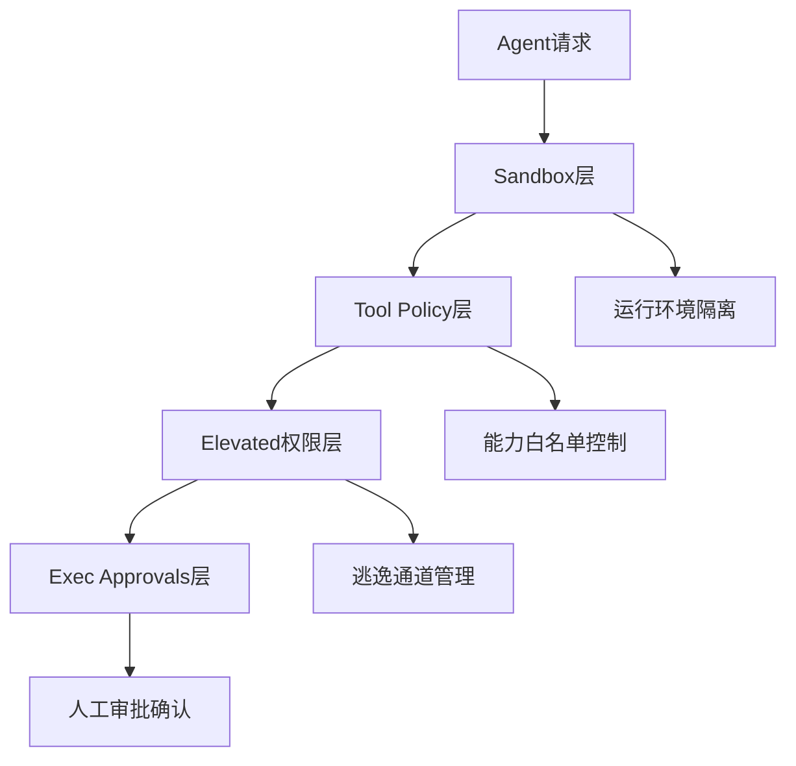
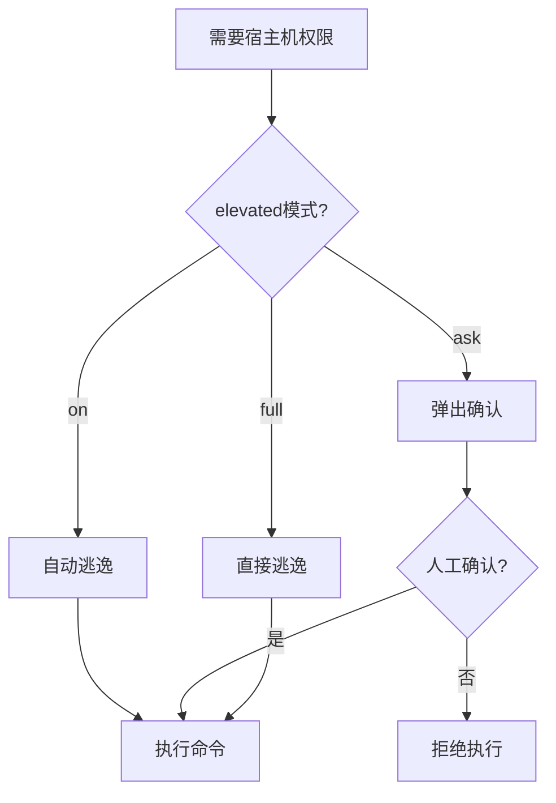
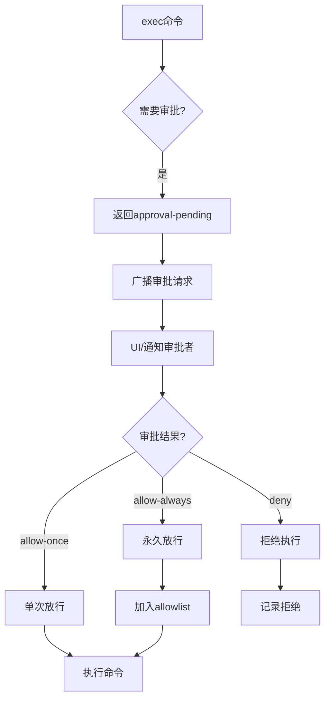
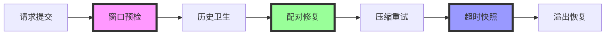

# Agent安全三层架构：OpenClaw安全体系深度解析

> 把AI Agent的副作用关进笼子的工程化实践

## 🎯 核心问题

AI Agent的工具调用不是"能力"，而是"**权限**"：
- 🔑 能不能读文件
- 🔑 能不能写文件  
- 🔑 能不能执行命令
- 🔑 能不能修改配置
- 🔑 能不能对外发送消息

**核心观点**：**真正决定能否上线的，是副作用是否可控**

## 🏗️ 三层安全架构



## 🛡️ 第一层：Sandbox（运行环境隔离）

### 核心目标：解决"在哪里跑"

### 技术实现
```yaml
sandbox_config:
  container:        # Docker容器化
    network: none   # 默认无网络
    workspace:      # 工作区访问控制
      mode: [none, ro, rw]  # 无访问/只读/读写
    bind_mounts:    # 绑定挂载控制
      - "/safe/path:/workspace:ro"
      
  isolation_level:
    filesystem:     # 文件系统隔离
      host_access: false    # 禁止宿主机访问
    network:        # 网络隔离
      external_access: false # 禁止外网访问
    process:        # 进程隔离
      privileged: false      # 非特权模式
```

### 关键保护规则
1. **第一条用户消息前的工具结果不修剪**
   - 包含启动时的身份文件、工作区说明
   - 避免Agent忘记"自己在哪个项目"

2. **最近工具结果保护区**
   - 保护最近3条assistant关联的tool result
   - 避免删除当前决策依赖的短期记忆

3. **图片类结果特殊处理**
   - 支持工具白名单和黑名单
   - 按"内容形态+工具种类+距离决策远近"综合判断

### 成本优化：TTL缓存机制
```yaml
cache_optimization:
  ttl: "5m"                   # 5分钟TTL
  provider_alignment: true    # 与Anthropic cacheRetention对齐
  economics:                  # 成本优化
    cache_write_cost: high    # CacheWrite费用高
    cache_read_cost: low      # CacheRead费用低
  strategy: "delay_pruning"   # 等缓存过期后再修剪
```

## ⚙️ 第二层：Tool Policy（能力白名单）

### 核心目标：解决"能不能用"

### 策略设计
```yaml
tool_policy:
  # 白名单模式（精确控制）
  allowlist:
    - "read_file"          # 允许读取文件
    - "bash:ls,cat,grep"   # 允许特定bash命令
    - "browser:get"        # 允许浏览器GET
    
  # 黑名单模式（硬性拒绝）
  denylist:
    - "rm"                 # 禁止删除命令
    - "sudo"               # 禁止提权
    - "curl|bash"          # 禁止管道执行
    
  # 分层策略
  layers:
    global:               # 全局策略
      - "deny:destructive_ops"
    sandbox:              # Sandbox专用策略
      - "allow:safe_tools_only"
```

### 设计原则
1. **Deny永远更硬**：黑名单优先级高于白名单
2. **最小权限原则**：只开放完成任务必需的最小工具集
3. **分层治理**：全局策略 + 环境专用策略
4. **动态调整**：根据风险评估动态调整策略

### 典型配置
```yaml
# 生产环境基线配置
production_baseline:
  allow:
    - read_file:        # 文件读取
        paths: ["/workspace", "/config"]
        exclude: [".env", "*.key"]
    - bash:             # 安全命令
        commands: ["ls", "cat", "grep", "find"]
        deny: ["rm", "sudo", "wget", "curl"]
    - browser:          # 浏览器
        methods: ["GET"]
        domains: ["*.github.com", "*.npmjs.com"]
        
  deny:
    - group: "destructive"    # 破坏性操作组
    - group: "privileged"     # 特权操作组
    - pattern: "*curl*bash*"  # 管道执行模式
```

## 🔓 第三层：Elevated（逃逸通道）

### 核心目标：Sandbox内跳回宿主机的可控机制

### 三种模式
| 模式 | 描述 | 安全性 | 使用场景 |
|------|------|--------|----------|
| **on** | 自动逃逸 | 中 | 可信环境，频繁需要宿主机权限 |
| **ask** | 询问后逃逸 | 高 | 半可信环境，需要人工确认 |
| **full** | 完全逃逸 | 低 | 紧急场景，跳过所有检查 |

### 工作流程


### 安全机制
1. **allowlist匹配**：按解析后的可执行文件路径匹配
   - ✅ `/usr/bin/jq` - 精确路径匹配
   - ❌ `jq` - basename不可靠

2. **safe bins限制**：常见命令设为stdin-only模式
   ```yaml
   safe_bins: [jq, grep, cut, sort, uniq, head, tail, tr, wc]
   restrictions:
     - no_file_arguments    # 禁止文件参数
     - no_shell_expansion   # 避免shell展开
   ```

3. **结构化补丁**：摘要输出包含关键状态信息
   ```yaml
   structured_patches:
     - Tool Failures          # 工具失败记录
     - <read-files>           # 已读文件列表
     - <modified-files>       # 已修改文件
     - <workspace-rules>      # 工作区关键规则
   ```

## 👥 第四层：Exec Approvals（人工审批）

### 核心目标：把"最后一步"变成系统可验证的形状

### 审批流程


### 审批状态文件
```json
{
  "exec-approvals": {
    "defaults": {
      "security": "ask",
      "askFallback": "deny"
    },
    "agents": {
      "agent-id-123": {
        "/usr/bin/jq": "allow-always",
        "/usr/bin/curl": "allow-once",
        "/usr/bin/rm": "deny"
      }
    }
  }
}
```

### 关键设计
1. **路径精确匹配**：基于解析后的完整路径
2. **分级审批策略**：单次/永久/拒绝三种选择
3. **fallback机制**：UI不可达时默认拒绝
4. **审计追踪**：完整的审批执行记录

## 🔄 执行顺序与依赖关系

### 固定处理流程


### 层级依赖
- **上层不依赖下层**：Sandbox失效不影响Tool Policy
- **下层为上层兜底**：Tool Policy失败仍可用Elevated
- **同级策略可叠加**：多个安全机制同时生效

## 📊 横向对比：OpenClaw vs 其他系统

| 维度 | OpenClaw | 传统Agent | 改进点 |
|------|----------|-----------|--------|
| **隔离粒度** | Docker级隔离 | 进程级隔离 | 更强的环境隔离 |
| **权限控制** | 四层递进 | 一次性授权 | 渐进式权限开放 |
| **审批机制** | 系统级验证 | 人工确认 | 可审计、可回溯 |
| **故障恢复** | 完整降级链路 | 简单报错 | 多层恢复机制 |
| **成本优化** | 与缓存对齐 | 无优化 | 显著降低成本 |

## 🛠️ 工程配置参考

### 关键参数
```yaml
# 核心安全配置
security_config:
  sandbox:
    enabled: true
    network: none
    workspace_access: ro
    
  tool_policy:
    mode: "allowlist"
    default_action: "deny"
    
  elevated:
    enabled: true
    default_mode: "ask"
    escape_hatch: true
    
  approvals:
    required: true
    fallback: "deny"
    audit_logging: true
```

### 调试命令
```bash
# 查看当前上下文使用情况
/status

# 查看token消耗详情  
/usage tokens

# 安全检查
openclaw security audit

# 解释为什么工具被挡
openclaw sandbox explain
```

## ⚠️ 常见坑与最佳实践

### 常见配置错误
1. **错误**：`allow: ["bash"]` # 太宽泛
   **正确**：`allow: ["bash:ls,grep,cat"]` # 精确到命令

2. **错误**：`workspaceAccess: rw` # 默认可写
   **正确**：`workspaceAccess: ro` # 默认只读，需要时再开放

3. **错误**：`elevated: full` # 跳过所有检查
   **正确**：`elevated: ask` # 保留人工确认环节

### 最佳实践清单
```yaml
production_checklist:
  before_go_live:
    - "sandbox已启用并测试通过"
    - "tool_policy已配置白名单"
    - "elevated默认设为ask模式"
    - "approvals已配置fallback=deny"
    - "审计日志已开启"
    - "安全扫描已通过"
    - "应急预案已制定"
    
  ongoing_operations:
    - "定期review allowlist"
    - "监控异常工具调用"
    - "审计日志定期检查"
    - "权限策略定期更新"
    - "安全扫描定期执行"
```

## 🎯 核心洞察

### 真正的安全不是"绝对安全"，而是"**可控的安全**"
- ✅ 每一层都有明确的边界和责任
- ✅ 失败时有清晰的降级路径  
- ✅ 问题发生时能审计和回溯
- ✅ 系统始终处于可理解和可管理状态

### 四层安全的核心价值
1. **Sandbox**：把"能破坏的范围"最小化
2. **Tool Policy**：把"能做的事情"白名单化
3. **Elevated**：把"必须破例的事情"流程化
4. **Approvals**：把"最终决策"人工化

## 💡 行动建议

### 对个人开发者
1. **理解原理**：掌握每层的安全设计思想
2. **正确配置**：学会合理配置安全参数
3. **安全意识**：把安全考虑融入日常开发
4. **持续学习**：关注最新的安全最佳实践

### 对技术团队
1. **建立规范**：制定团队安全设计规范
2. **培训教育**：提升团队整体安全意识
3. **工具化**：将安全检查融入CI/CD流程
4. **定期审计**：建立定期安全检查机制

### 对企业架构
1. **安全战略**：将AI安全纳入企业安全战略
2. **标准制定**：参与行业标准制定
3. **人才培养**：培养专业的AI安全人才
4. **生态建设**：构建可信AI生态系统

---

> **最终结论**：OpenClaw的三层安全架构真正值钱的地方，不是"做了多少安全检查"，而是"**把不可控的副作用变成了可治理的工程问题**"。

**关键转变**：从"相信AI不会犯错"到"**假设AI会犯错，但系统能兜住**"——这才是AI工程化时代的安全观。