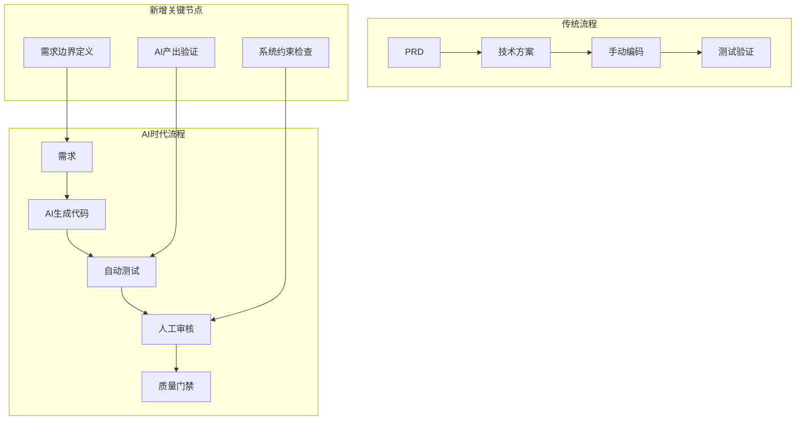

# 当 AI 完成了大部分代码，架构师何去何从

> 基于 Gergely Orosz 深度文章的工程化思考

## 🎯 核心观点

**AI 先压缩的是手写代码，软件工程责任并没有一起缩水。**

真正被抬高身价的，是"定义边界、验证结果、承担责任"这几个位置。

## 📊 时代背景

### 能力拐点时间线
- **2025年11月17日**：Google 发布 Gemini 3
- **2025年11月24日**：Anthropic 发布 Opus 4.5  
- **2025年12月11日**：OpenAI 发布 GPT-5.2

### 关键信号
- ✅ 手机就能指挥 Claude 改代码、跑测试、提 PR
- ✅ 中等规模任务，模型产出接近"我自己也会这么写"
- ✅ 工具开始承担完整开发环节，而不只是补全

> **限定条件**：这些突破发生在**边界清晰、测试完整、风险不高**的代码库上。大型科技公司的复杂系统（组织流程、历史包袱、兼容性约束）冲击不会那么直接。

## 📈 数据印证

### Cortex 2026 基准报告
- **调研范围**：50+位工程负责人
- **关键发现**：变更失败率上升了30%
- **原因**：代码量暴增后，问题来得更快了

### Atlassian 2025 开发者体验报告
- **调研规模**：3500人参与
- **核心数据**：开发者平均每周仅16%时间在写代码
- **结论**：即使AI写全部代码，解放的只是工作周中的一小部分

## 🎯 责任迁移方向

### 正在升值的能力
| 能力类型 | 具体内容 | 价值体现 |
|---------|----------|----------|
| **需求澄清** | 把模糊目标转成清晰约束 | 减少AI走偏 |
| **架构边界** | 预判生成代码的边界问题 | 避免系统性风险 |
| **验证体系** | 建立可执行的验证方式 | 确保AI产出质量 |
| **风险兜底** | 在高吞吐下守住质量底线 | 承担最终责任 |

### 正在被压缩的价值
- ❌ 重复性 CRUD、样板代码
- ❌ 跨语言搬运、手工翻译需求
- ❌ 框架熟练度但缺乏系统判断
- ❌ 只接任务、不定义问题的角色

### 正在稀缺的能力
- ✅ 能把复杂系统拆清楚，让Agent高效工作
- ✅ 能在出事时快速定位、决策、兜底
- ✅ Tech Lead思维 + Product-minded Engineer视角

## 🏗️ 四道核心护栏

### 1. 验证护栏（最重要）
> "AI常见的问题不是'完全不会写'，而是'看起来很像能用，但你不能直接信'"

**四个层次**：
```yaml
验证体系:
  unit_test:        # 覆盖关键逻辑和边界条件
  integration_test: # 确认服务间真实协作  
  regression_test:  # 避免修一个地方坏三个地方
  acceptance_test:  # "什么叫完成"的可核对条件
```

**关键转变**：测试体系从"为人类工程师准备"变成"为Agent准备"——测试成为生产系统的一部分。

### 2. 观测护栏
> "代码写得更快，不代表问题更容易定位"

**必备能力**：
- 🔍 **性能监控**：哪个接口慢了
- 📊 **错误追踪**：哪个调用链出错了  
- 📈 **退化检测**：哪条用户路径开始退化
- 🚨 **异常识别**：哪类异常是新引入的

**现实转变**：可观测性从"有了更好"变成"准入门槛"

### 3. 约束护栏
> "团队越依赖Agent，越不能只靠'请小心一点'这类对话式约束"

**系统化约束**：
```yaml
约束机制:
  directory_level:    # 高风险目录默认只读
  operation_confirm:  # 删除/外发/批量修改需人工确认
  environment_isolation: # 生产环境强隔离
  permission_grading:   # 按任务和角色分级，不是一把梭
```

### 4. 回滚护栏
> "AI编码时代最容易被忽略的，是撤退能力"

**必备机制**：
- 🔄 **清晰版本边界**：Git标签 + 自动化脚本
- ⚡ **自动化回滚**：一键回滚能力
- 💾 **数据变更保护**：数据库迁移可逆
- 🚦 **灰度与开关**：Feature Flag机制

## 🔄 工程流程重构

### 传统流程 vs AI时代流程



### 关键变化

| 传统角色 | AI时代变化 | 新要求 |
|---------|------------|--------|
| **产品经理** | 需求翻译层变薄 | 更懂技术边界，能做原型验证 |
| **工程师** | 实现层被压缩 | 更强系统思维，负责结果兜底 |
| **测试人员** | 测试自动化 | 专注测试策略设计，异常场景覆盖 |

## 🎯 架构师新定位

### 核心职责升级
1. **系统边界定义者**
   - 定义AI可操作的范围
   - 设定架构约束和红线
   - 建立模块间接口契约

2. **质量验证设计者**
   - 设计AI产出的验证体系
   - 建立质量门禁和检查点
   - 确保验证体系可自动化执行

3. **风险兜底承担者**
   - 建立故障恢复机制
   - 设计系统降级策略
   - 承担最终上线责任

4. **团队协作协调者**
   - 重新定义人机协作流程
   - 建立AI辅助开发规范
   - 推动团队能力转型升级

### 能力模型转变
```yaml
传统架构师:
  - 技术选型
  - 架构设计  
  - 代码审查
  - 性能优化

AI时代架构师:
  - AI边界定义
  - 验证体系设计
  - 风险兜底机制
  - 人机协作流程
  - 质量责任承担
```

## 📋 团队落地检查清单

### 基础能力评估
- [ ] 关键链路有自动化测试（不是主要靠人工点点点）
- [ ] 仓库文档可信（不是长期滞后于真实实现）
- [ ] 高风险操作有明确人工确认和权限隔离
- [ ] 日志、指标、Trace完整（能快速定位异常变更）
- [ ] 发布链路支持灰度、回滚和开关
- [ ] 团队明确"AI生成代码由谁负责"
- [ ] 代码评审标准更新（适应AI生成代码特点）
- [ ] 产品、工程、测试有统一完成标准机制

### AI就绪度评估
- [ ] 有可靠的测试基线
- [ ] 有让Agent理解的代码与文档结构
- [ ] 有把高风险动作隔离开的机制
- [ ] 有在结果不对时快速发现并回退的能力
- [ ] 有关键约束在长会话里不漂移的机制

## ⚠️ 风险提醒

### 工作与生活边界
> "当Agent可以在手机上跑、随时随地改代码时，'不在电脑前'这道防线也可能被突破"

**建议**：
- 设定明确的AI辅助开发时间边界
- 建立非紧急不打扰的团队公约
- 把AI工具纳入正常工作流程，而非7×24待命

## 🎯 最终判断

### 真正的分水岭
**不是**团队会不会用 Claude Code、Codex 或 Cursor  
**而是**能不能把生成结果放进一套**可验证、可追责、可维护**的工程系统里

### 最值钱的两类人
1. **能把复杂系统拆清楚，让Agent高效工作的人**
2. **能在出事时快速定位、决策、兜底的人**

这两类能力，本质上更接近"**软件工程负责人**"而不是"**纯代码执行者**"。

## 💡 行动建议

### 短期（1-3个月）
- ✅ 补齐测试体系，让AI产出可验证
- ✅ 建立代码质量门禁，AI代码必须通过
- ✅ 完善可观测性，能快速定位问题
- ✅ 更新代码评审标准，适应AI生成特点

### 中期（3-6个月）
- ✅ 建立AI辅助开发规范流程
- ✅ 设计系统化的约束机制
- ✅ 推动团队能力转型升级
- ✅ 建立质量责任体系

### 长期（6-12个月）
- ✅ 建立完整的AI开发生态
- ✅ 形成最佳实践知识库
- ✅ 持续优化人机协作模式
- ✅ 建立行业竞争优势

---

> **最终结论**：AI会让"写代码"更便宜，但会让"对系统负责"更昂贵。架构师的价值不是被削弱，而是从"写得好"升级为"想得清、管得住、兜得底"。真正的机会在于：成为那个能把AI能力装进可靠工程体系的人。