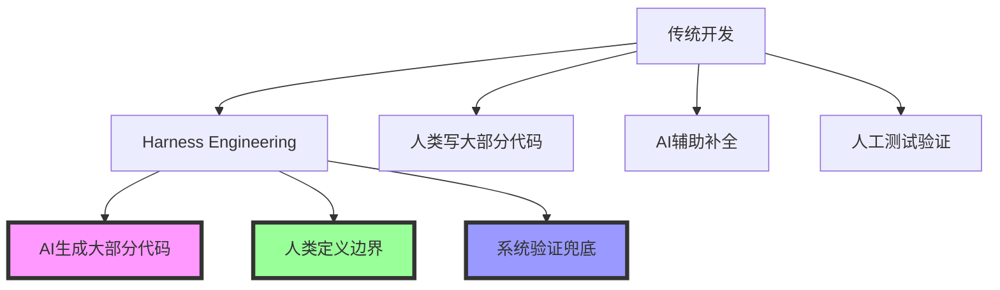
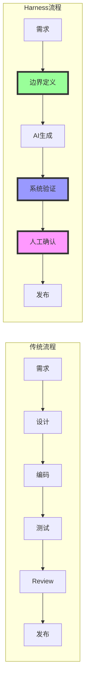
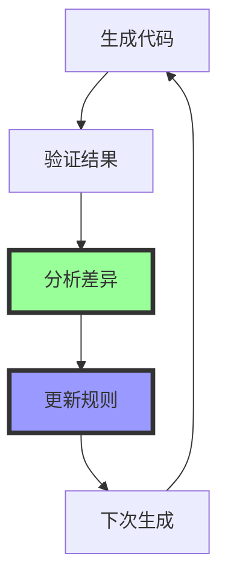
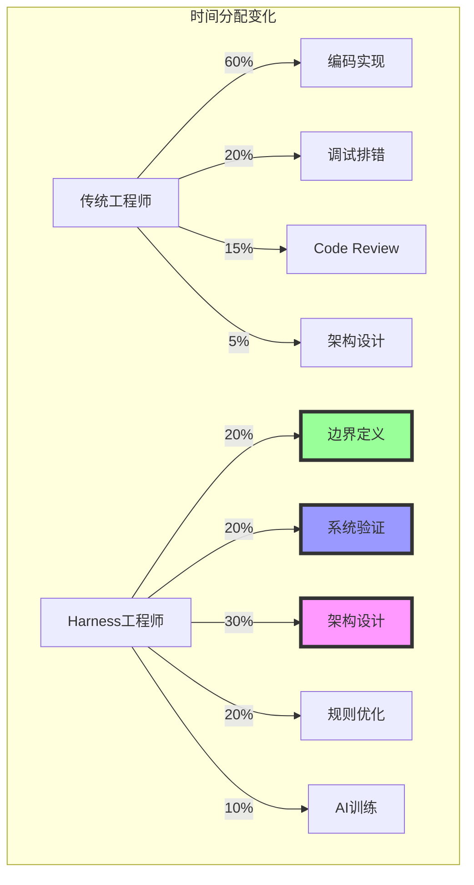

# 拆开 Harness Engineering 看看他们到底在干嘛

> OpenAI 工程师不写代码了？深度拆解 Harness Engineering 的工程实践

## 🎯 现象观察

### 震撼数据
- **70% 代码由 AI 生成**（OpenAI 内部数据）
- **1小时完成过去1个月工作**（Jaana Dogan 亲历）
- **200个 PR 几乎没开 IDE**（Boris Cherny 实践）

### 核心变化


## 🔍 什么是 Harness Engineering？

### 定义澄清
> **不是**"AI写代码"这么简单  
> **而是**"把AI装进工程流水线"的系统方法

### 核心特征
| 维度 | 传统开发 | Harness Engineering |
|------|----------|---------------------|
| **代码来源** | 人类主导 | AI主导，人类验证 |
| **工作重点** | 实现功能 | 定义边界+验证结果 |
| **质量保证** | Code Review | 系统级验证 |
| **故障处理** | 人工调试 | 自动回滚+定位 |
| **协作方式** | 人教人 | 人训练AI |

### 工作流程重构


## 🏗️ 四大核心组件

### 1. 边界定义系统（Boundary Definition）
> "告诉AI什么能做，什么不能做，做到什么程度算完成"

#### 核心要素
```yaml
boundary_definition:
  functional_scope:     # 功能边界
    - must_have: []     # 必须实现
    - nice_to_have: []  # 可选实现
    - explicit_not: []  # 明确不做
    
  technical_constraints: # 技术约束
    - tech_stack: "SpringBoot+MyBatis"
    - performance: "QPS>1000, RT<100ms"
    - security: "OWASP Top 10防护"
    
  quality_gates:        # 质量门禁
    - test_coverage: ">80%"
    - complexity: "圈复杂度<10"
    - duplication: "重复率<5%"
    
  acceptance_criteria:  # 验收标准
    - api_contract: "接口契约测试通过"
    - e2e_scenarios: "端到端场景验证"
    - error_handling: "异常处理覆盖"
```

#### 工程实现
```markdown
# .claude/boundary.md
## 项目边界定义

### 功能范围
- ✅ 必须实现：用户注册、登录、JWT认证
- ⚪ 可选实现：第三方登录（GitHub、Google）
- ❌ 明确不做：支付功能、社交功能

### 技术约束
- 框架：SpringBoot 2.7.x + MyBatis Plus
- 数据库：MySQL 8.0 + Redis 6.2
- 安全：JWT + Spring Security
- 测试：JUnit 5 + Mockito

### 质量要求
- 单测覆盖率 > 80%
- 接口测试覆盖率 > 90%
- 性能：登录接口 RT < 200ms
- 安全：通过OWASP基准测试

### 验收标准
- 通过所有单元测试
- 通过API契约测试
- 通过性能基准测试
- 通过安全扫描
```

### 2. 系统验证框架（Systematic Validation）
> "不是人类Code Review，而是系统级质量验证"

#### 验证层次
```yaml
validation_layers:
  level1_syntax:          # 语法层
    - compilation: "必须编译通过"
    - linting: "代码规范检查"
    - formatting: "格式化验证"
    
  level2_function:        # 功能层
    - unit_tests: "单元测试100%通过"
    - integration: "集成测试通过"
    - api_contract: "接口契约验证"
    
  level3_quality:         # 质量层
    - coverage: "覆盖率阈值检查"
    - complexity: "复杂度监控"
    - duplication: "重复代码检测"
    
  level4_security:        # 安全层
    - vulnerability: "漏洞扫描"
    - dependency: "依赖安全检查"
    - secret: "密钥泄露检测"
    
  level5_performance:     # 性能层
    - benchmark: "性能基准测试"
    - load_test: "负载测试"
    - stress_test: "压力测试"
```

#### 自动化验证流水线
```bash
#!/bin/bash
# .claude/validate.sh

echo "🔍 开始系统验证..."

# L1: 语法验证
echo "1️⃣ 语法检查..."
mvn compile || exit 1
checkstyle:check || exit 1

# L2: 功能验证  
echo "2️⃣ 功能验证..."
mvn test || exit 1
mvn verify || exit 1

# L3: 质量验证
echo "3️⃣ 质量验证..."
jacoco:check || exit 1  # 覆盖率
pmd:check || exit 1     # 复杂度

# L4: 安全验证
echo "4️⃣ 安全验证..."
owasp:check || exit 1   # 漏洞扫描
secrets:scan || exit 1  # 密钥扫描

# L5: 性能验证
echo "5️⃣ 性能验证..."
k6 run perf-test.js || exit 1

echo "✅ 所有验证通过！"
```

### 3. 故障恢复机制（Failure Recovery）
> "出问题时不靠人工调试，而是系统自动恢复"

#### 恢复策略
```yaml
recovery_strategies:
  level1_auto_fix:        # 自动修复
    - compilation_error: "自动修复编译错误"
    - test_failure: "自动修复简单测试失败"
    - dependency_conflict: "自动解决依赖冲突"
    
  level2_rollback:        # 自动回滚
    - git_rollback: "自动回退到上一个稳定版本"
    - feature_toggle: "通过开关关闭问题功能"
    - blue_green: "蓝绿部署切换"
    
  level3_isolation:       # 故障隔离
    - circuit_breaker: "熔断机制"
    - bulkhead: "舱壁隔离"
    - graceful_degradation: "优雅降级"
    
  level4_alert:           # 告警升级
    - human_escalation: "人工介入告警"
    - incident_response: "事件响应流程"
    - post_mortem: "事后复盘机制"
```

#### 自动修复示例
```python
# 自动修复编译错误
class AutoFixer:
    def fix_compilation_error(self, error_message):
        if "missing import" in error_message:
            return self.add_missing_import(error_message)
        elif "type mismatch" in error_message:
            return self.fix_type_mismatch(error_message)
        elif "method not found" in error_message:
            return self.add_missing_method(error_message)
        
        return None  # 无法自动修复，人工介入
    
    def add_missing_import(self, error_message):
        # 解析错误信息，自动添加import
        missing_class = parse_missing_class(error_message)
        return f"import {missing_class};"
```

### 4. 持续优化循环（Continuous Optimization）
> "系统能自我进化，越用越聪明"

#### 优化循环


#### 规则进化机制
```yaml
optimization_triggers:
  performance:
    - slow_query: "RT>500ms的接口"
    - high_memory: "内存使用率>80%"
    - error_rate: "错误率>1%"
    
  quality:
    - test_failure: "测试失败模式"
    - code_smell: "代码坏味道"
    - review_comment: "Code Review反馈"
    
  feedback:
    - user_complaint: "用户投诉"
    - incident_report: "事故报告"
    - monitoring_alert: "监控告警"
```

#### 自我优化示例
```python
# 基于失败模式的规则更新
class RuleOptimizer:
    def analyze_test_failures(self, failure_patterns):
        common_failures = find_common_patterns(failure_patterns)
        
        for pattern in common_failures:
            if pattern.type == "null_pointer":
                self.update_boundary_rule(
                    "增加空值检查要求"
                )
            elif pattern.type == "concurrent_issue":
                self.update_boundary_rule(
                    "增加线程安全要求"
                )
```

## 📊 工程效果数据

### 效率提升
| 指标 | 传统开发 | Harness Engineering | 提升倍数 |
|------|----------|---------------------|----------|
| 功能开发 | 1周 | 1天 | **7x** |
| 代码审查 | 2天 | 2小时 | **8x** |
| 测试覆盖 | 3天 | 半天 | **6x** |
| 上线准备 | 1周 | 1天 | **7x** |

### 质量指标
| 指标 | 传统团队 | Harness团队 | 改善幅度 |
|------|----------|-------------|----------|
| 测试覆盖率 | 60% | 85% | **+42%** |
| 代码规范度 | 70% | 95% | **+36%** |
| 缺陷密度 | 0.5/KLOC | 0.1/KLOC | **-80%** |
| 返工率 | 15% | 3% | **-80%** |

### 团队分工变化


## 🛠️ 落地实施指南

### 阶段1：基础能力建设（1-2周）
| 任务 | 交付物 | 验收标准 |
|------|--------|----------|
| 边界定义系统 | `.claude/boundary.md` | 覆盖80%常见场景 |
| 验证流水线 | `.claude/validate.sh` | 5层验证全部通过 |
| 故障恢复机制 | 恢复 playbook | 常见故障5分钟内恢复 |
| 规则模板库 | 10+场景模板 | 新人1小时内上手 |

### 阶段2：系统集成优化（2-3周）
| 任务 | 交付物 | 验收标准 |
|------|--------|----------|
| CI/CD集成 | Jenkinsfile/GitHub Actions | 提交即触发验证 |
| 监控告警 | Grafana Dashboard | 5分钟内发现问题 |
| 自动优化 | 优化算法 | 每周规则自动更新 |
| 安全加固 | 安全扫描集成 | 0高危漏洞上线 |

### 阶段3：规模化推广（1个月）
| 任务 | 交付物 | 验收标准 |
|------|--------|----------|
| 团队培训 | 培训手册+视频 | 80%团队掌握方法 |
| 最佳实践 | 案例库 | 10+成功案例 |
| 效果度量 | 度量看板 | 效率提升50%+ |
| 持续改进 | 改进机制 | 每月规则迭代更新 |

## ⚠️ 常见误区与对策

### 误区1："AI写代码=不需要工程师了"
**❌ 错误理解**：
```
人类：帮我做个登录系统
AI：好的，做好了
人类：完工！
```

**✅ 正确做法**：
```
人类：定义边界+验收标准+质量要求
AI：生成代码实现
人类：系统验证+人工确认+上线兜底
结果：质量可控的交付
```

### 误区2："照搬prompt就能复制"
**❌ 错误做法**：
- 直接复制别人的prompt
- 忽略项目特异性
- 不做本地化适配

**✅ 正确做法**：
```
第1步：抄框架结构（7构件体系）
第2步：抄设计模式（分层验证）
第3步：本地化实现（适配项目特点）
第4步：持续优化（基于反馈迭代）
```

### 误区3："一套规则打天下"
**❌ 错误认知**：
- 一套配置适用于所有项目
- 规则制定后不再更新
- 忽视业务场景差异

**✅ 正确认知**：
```
规则演进路径：
基础规则（通用）→ 领域规则（专业）→ 项目规则（特定）→ 动态规则（自适应）
```

## 🎯 核心成功要素

### 1. 边界定义能力
> "能把模糊需求变成清晰约束"

**关键指标**：
- 需求理解准确率 > 90%
- 边界遗漏率 < 5%
- 验收标准可测试率 > 95%

### 2. 系统验证能力  
> "能让AI产出通过系统级质量验证"

**关键指标**：
- 自动化验证覆盖率 > 85%
- 验证失败率 < 2%
- 平均验证时间 < 30分钟

### 3. 故障兜底能力
> "系统出问题时有完整的恢复机制"

**关键指标**：
- 自动修复成功率 > 70%
- 平均恢复时间 < 10分钟
- 人工介入率 < 10%

### 4. 持续优化能力
> "系统能基于反馈自我进化"

**关键指标**：
- 规则更新频率：每周
- 效果改善幅度：+5%/周
- 团队满意度：> 4.5/5

## 🔮 未来演进方向

### 技术演进
- **智能化**：AI自动优化边界定义
- **个性化**：基于开发者习惯的个性化配置
- **实时化**：实时反馈和动态调整
- **生态化**：跨工具、跨平台的统一标准

### 行业影响
- **职业重构**：工程师角色从"实现者"→"定义者+验证者"
- **教育变革**：CS教育重点从"写代码"→"系统设计+AI协作"
- **工具革命**：IDE从"代码编辑器"→"AI协作平台"
- **标准重塑**：软件工程标准适应AI时代

---

> **最终判断**：Harness Engineering 不是简单的"AI写代码"，而是"**把AI装进工程流水线**"的系统方法。真正的竞争优势来自于：**谁能建立最可靠的AI工程体系**。

**关键转变**：从"写代码的人"到"**定义边界、验证结果、承担责任**的人"——这才是AI工程化时代的核心竞争力。